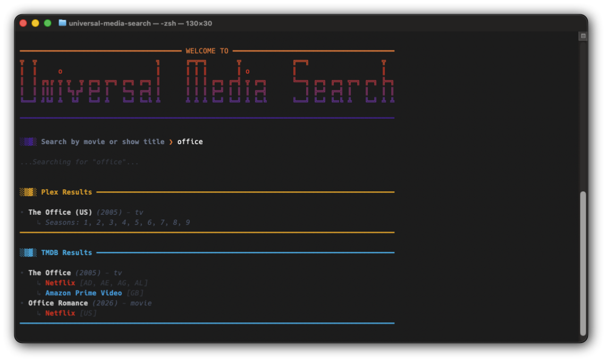

# Universal Media Search CLI

> **Because life is too short to open 5 different streaming apps just to figure out where to watch *The Office*.**

Welcome to the **Universal Media Search CLI**! This is a lightweight CLI tool (command-line app) that acts as your personal media assistant. You just type in a movie or TV showm and it will instantly search your local media server (currently only Plex), and every streaming service you are currently subscribed to.

The best part? It checks for results in every single country your streaming providers are available in. So, if a movie isn't available on, let's say, Netflix in your home country, the app will tell you if it's streaming on Netflix in Canada, or the UK, making it the ultimate companion if you use a VPN to hop location blocks!



## What Does It Do?
- **Searches Home Base:** Checks your local Plex server first (local is always better!).
- **Global Streaming Search:** Scans international catalogs of your specific streaming services.
- **Color-Code UI:** Returns clean, terminal-friendly results with custom brand colors for major streaming networks.
- **Privacy Focused:** Runs locally from your computer to your server(s) - I don't see or collect any of your data. *TMDB might, check their terms for accessing their database.
- **Privacy First:** Direct API requests with *no middleman servers*. The app runs locally on your machine and communicates directly with your media server(s) and TMDB\*. I don't track, collect, or store any of your keys or search queries.

*\*NOTE: External search requests sent to TMDB (The Internet Movie Database) are subject to TMDB's standard API logging and privacy terms.*

---

## Quickstart & Configuration

### 1. Installation
Clone the repository, set up your virtual environment, and install the dependencies:
```bash
git clone [https://github.com/Raffosaurus/universal-media-search.git](https://github.com/Raffosaurus/universal-media-search.git)
cd universal-media-search
python3 -m venv .venv && source .venv/bin/activate
pip install -r requirements.txt
```

### 2. Environment Variables
Create your local environment file by copying the template:
```bash
cp .env.example .env
```

Open `.env` and add your Plex and TMDB credentials:
```ini
PLEX_URL="http://[YOUR_PLEX_IP]:32400"
PLEX_TOKEN="your_plex_token"
TMDB_API_KEY="your_tmdb_api_key"
```

### 3. Customize Your Streaming Providers
By default, the app searches for Netflix and Amazon Prime Video in the US. To tailor it to your exact subscriptions, open `src/tmdb.py` and modify these two variables near the top of the file:

* `HOME_REGION`: Set this to your local country code (e.g., `"US"`, `"CA"`, `"GB"`).
* `MY_PROVIDER_IDS`: Add the TMDB provider IDs for the services you pay for (e.g., `8` for Netflix, `337` for Disney+). A quick list of common IDs is provided directly in the file.

---

## 🚀 Usage
Whenever you want to search for a title, just ensure your virtual environment is active and run the main script:
```bash
python main.py
```

Type in your movie or show title, hit Enter, and let the UMS CLI do the heavy lifting.

---

## Roadmap
- [ ] **Jellyfin Support:** Adding support for Jellyfin media servers alongside Plex.
- [ ] **Season-Specific Streaming Data:** Granular season tracking for streaming services (e.g., distinguishing when Netflix only has Seasons 1-3 vs. the full show run).